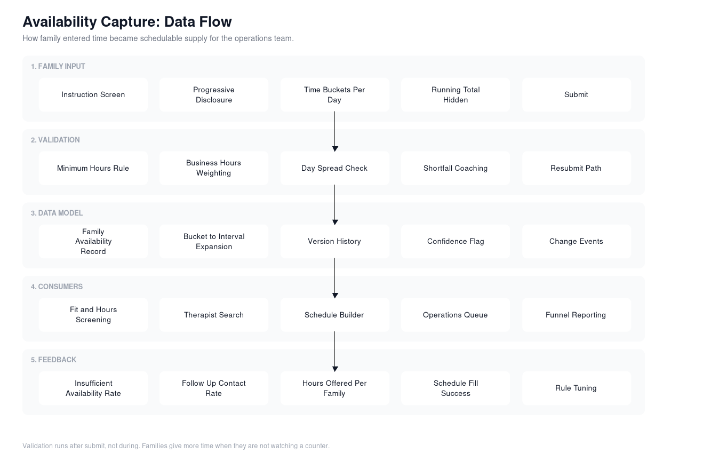

# Elemy: Inaugural Product Work

Case studies from building the product function at a pediatric behavioral health company, starting as employee number twelve and staying through the growth that followed.

The company reached unicorn valuation on a $219 million round during that period ([Fierce Healthcare](https://www.fiercehealthcare.com/digital-health/elemy-reaches-unicorn-status-boosted-by-219m-investment-from-softbank-chelsea)). Headcount went from a dozen people to more than 1,200. Most of what is written here exists because of that rate of change, not in spite of it.

I was the first technical product manager. There was no product process, no research function, no data foundation, and no design system worth defending. I built the family-facing product experience and the data capability underneath it, and I grew and managed the team that took it over.

No colleague names appear anywhere in this repository. No patient or family records, no protected health information, and no internal documents. Product mechanics, funnel data, and outcome numbers only.

## Case studies

| Case study | The problem | Outcome |
| --- | --- | --- |
| [Availability capture](docs/case-study-availability.md) | Collecting a family's weekly schedule took 25 minutes of agent phone time per family, for families who often did not enroll | Phone time for this step went to zero, and the hours families offered went up |
| [Onboarding automation](docs/case-study-onboarding-automation.md) | Every step of onboarding required an agent, so cost per acquired family scaled with headcount | Admissions ran with 20 fewer operations agents by year end |
| [Data foundation](docs/case-study-data-foundation.md) | Core entities were defined differently in every system, so nobody could answer basic funnel questions the same way twice | Shared entity definitions and a data capability that held while the company grew past 1,200 people |
| [Turning availability into schedulable supply](docs/case-study-supply-and-matching.md) | Families gave their ideal schedule, which was not enough time to build a real therapy plan | Time buckets increased usable hours without pushing more work onto families |

Funnel and outcome numbers are collected in [docs/outcomes.md](docs/outcomes.md).

## Diagrams

Where onboarding steps sit and what changed at each one:

How family entered time became supply the operations team could schedule against:

Sources are in `docs/` as `.svg`, and `docs/availability-flow.mmd` is Mermaid source that Lucidchart imports directly and GitHub renders in the browser.

## The thing that shaped everything

Availability capture happens right after a family creates an account. At that moment they have not seen a cost estimate and do not know whether they are approved for care. They are asking whether this company can help their child, and the product is asking them to hand over their week.

Every design decision in these case studies traces back to that position in the funnel. Ask for too much and they leave. Ask for too little and there is not enough time to build a therapy schedule, which sends the request back to a human two weeks later and burns the trust anyway.

## What this work shows

- I take the hairiest piece of a program and own it end to end rather than dividing it into something reportable.
- I run research myself when there is nobody to run it. Interviews, insight synthesis, ideation, and concepts inside the first 60 days, before there was a research function.
- I ship the unglamorous version when engineering capacity appears early, then hold the better solution ready for the moment the data proves it is needed.
- I argue about validation rules with operations partners, because rules are cheap to add and expensive for a family in a hard moment.
- I built the data layer under the funnel, so the numbers in these case studies came from a defined source rather than from four teams counting differently.
- I hired and grew the team that inherited it, and I stayed accountable for strategy after I stopped doing the hands-on work.

## Contact

GitHub: [ali8gates](https://github.com/ali8gates)
