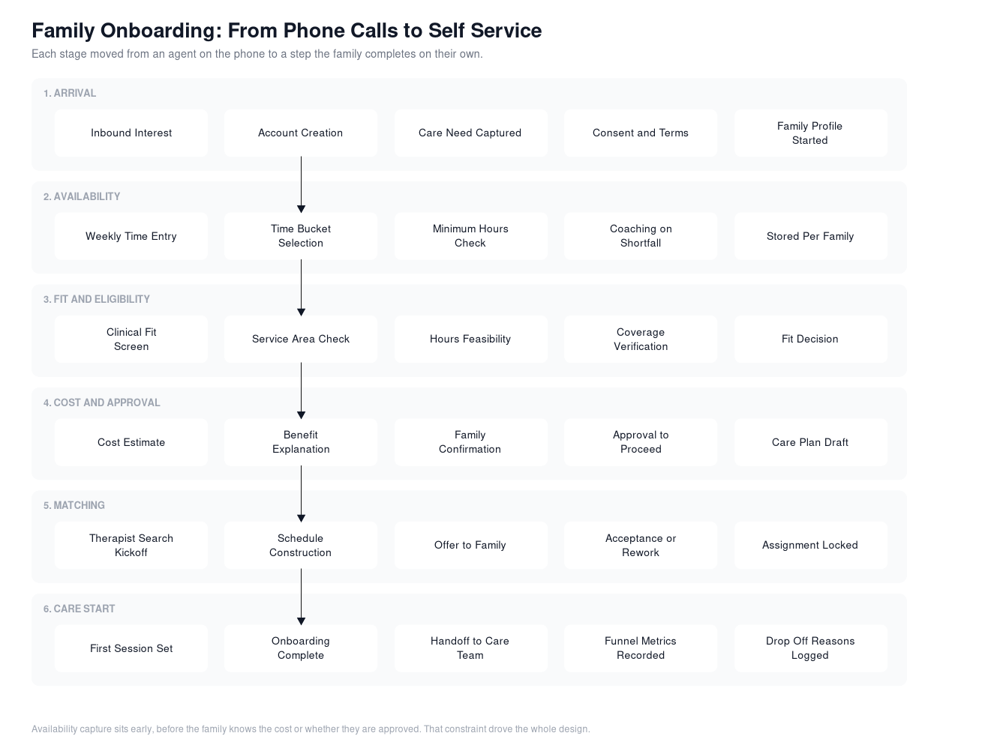

# Case Study: Onboarding Automation

The program the availability work sat inside. Goal for the year was to convert family onboarding from an agent-run process into something a family completes themselves, and to cut the cost of acquiring each family while doing it.

## Starting position

Every step of onboarding ran through a person. An agent talked a family through interest, need, eligibility, schedule, cost, and approval, then handed off to a therapist search that required more calls. Cost per acquired family moved in lockstep with headcount, and headcount was growing fast during a period when the company went from a dozen people to more than 1,200.

The other problem with an agent-run funnel is that it hides its own failures. When a family drops out of a phone conversation, nothing gets recorded except that the agent stopped calling.

## How I sequenced it

I led design or oversaw the work to convert each onboarding step into self service across the year. The sequencing rule was not technical difficulty. It was cost per family multiplied by how often the step was repeated.

That put availability collection first by a wide margin: 25 minutes of agent time per family, spent on families who had not yet been screened for fit, so much of it was spent on families who never enrolled.

Other steps went in the order that preserved the funnel. Account creation and need capture were low risk and moved early. Cost estimation and approval came later, because getting those wrong loses a family who was otherwise ready.

## The rule I held for every step

A step could only move to self service if it did two things:

1. Produced data at least as usable as what an agent produced by phone.
2. Did not increase the number of families operations had to chase afterward.

Half-automated steps are worse than manual ones. A form that produces a submission an agent has to call about anyway adds a step and removes none.

That rule is what sent the availability work back for a second version. The first one passed test one and failed test two.

## Where the design pressure was

**Order of the funnel.** The heaviest ask, handing over a family's week, sits before the family has a cost estimate or an approval decision. There was no way to move it later without delaying the therapist search, which was the point of collecting it. So the ask had to get lighter instead of moving.

**Operations wanting rules, families needing fewer.** Every quality problem operations hit produced a request for another validation rule. Each rule shifts work from an agent onto a parent in a difficult moment. My job was to say no to most of them and find a structural change instead, which is exactly what the switch to time buckets was.

**Not disrupting operations mid-flight.** Admissions was running at volume the entire time. Nothing could land that broke a process agents were depending on that week, which is why the first availability version was deliberately conservative.

## Outcomes

- Admissions ran with 20 fewer operations agents by the end of the year.
- Cost to acquire a new family dropped substantially, which was the stated goal of the program.
- Availability collection went from 25 minutes of agent phone time per family to none.
- The funnel started producing its own data. Where families stopped became a number rather than an anecdote.

## What I took from it

Automating a funnel is not a sequence of forms. It is a series of decisions about which party absorbs the complexity. Every rule you add is a cost you are moving onto the customer, and in this case the customer was a parent trying to get therapy for their child. That framing decided most of the arguments.
