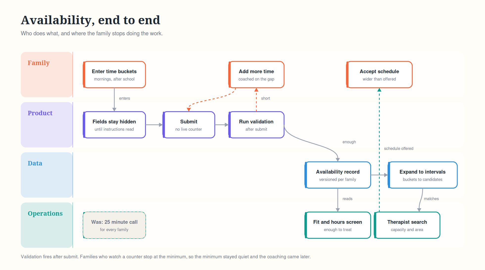

# Case Study: Turning Availability Into Schedulable Supply

The availability case study covers how families were asked for their time. This one covers what happened to that time afterward, because collecting hours and having schedulable hours are two different things.

## The gap

A family submits their ideal schedule. Operations needs to build a real weekly therapy plan against therapist capacity, in a specific service area, for a recommended dose that is often 25 to 30 hours.

Ideal schedules do not survive contact with that. Two families with the same stated hours are not equally schedulable, because what matters is whether their time overlaps with a therapist who has capacity nearby.

So the number to optimize was never "hours collected." It was "hours that can actually be turned into sessions."

## What the data model had to carry

The first version stored specific time selections, which is the obvious shape and the wrong one. It captured only the time a family considered free, and it gave operations no way to tell the difference between time that was firm and time that was flexible.

The bucket model fixed that by changing what was being stored. A bucket is a statement about a window rather than a commitment to a slot, which means it can be expanded into candidate intervals during matching instead of being treated as a fixed constraint.

What the record needed to hold:

- Availability by day and window, not just a set of intervals.
- An expansion path from bucket to candidate intervals for the schedule builder.
- Version history, since availability changes and a stale record sends a scheduler at a window that closed weeks ago.
- A signal for how much room there is in a submission, so operations knows which families are tight and which have slack.
- Change events, so downstream consumers learn about updates instead of re-reading the record on a timer.

## Who consumed it

Five different consumers with different needs, which is why the model mattered more than the form:

- **Fit and hours screening.** Is there enough time here to deliver the recommended dose at all.
- **Therapist search.** Which therapists with capacity intersect this family's windows.
- **Schedule builder.** Construct a concrete weekly schedule and offer it to the family.
- **Operations queue.** Which families need a human, and why.
- **Funnel reporting.** Where families stall and how often submissions come back insufficient.

That last consumer is the one teams usually forget until they need it. Reporting was a first-class consumer here, not an afterthought, because the entire program was justified on cost per family.

## The negotiation insight

The reason buckets worked is that a bucket lets the system come back with a schedule slightly wider than what the family volunteered, and families accept it. That was tested directly with families who had already given availability in an earlier study, and they accepted schedules containing times they had not originally listed.

A specific interval model cannot do this. Once a family says 4pm to 6pm, anything outside that reads as a violation. A bucket says "after school," and 3:30pm is inside the spirit of that even if the family would not have typed it.

## Outcomes

- Available hours per family increased after buckets were introduced.
- Schedule construction did not degrade. There were no significant obstacles scheduling families for therapy later in the funnel, which is the only result that would have justified the change.
- Follow up contact for insufficient availability dropped, because the structural change did the work that a longer list of validation rules had been failing to do.

## What this piece taught me

The interaction design and the data model are the same decision made twice. If they disagree, the data model wins and the experience pays for it. The first version proved that: a well-judged form on top of a too-literal storage shape put a ceiling on what the second version could do, and that ceiling cost real engineering time to raise.
